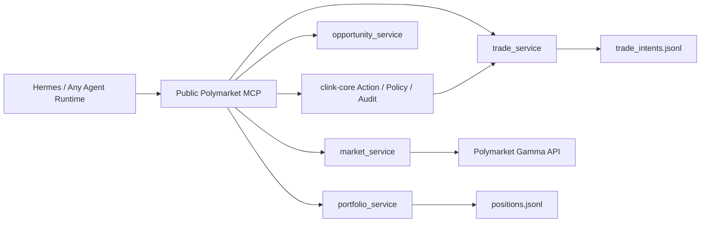

# clink-polymarket

`clink-polymarket` is the first financial A2A adapter built on top of `clink-core`.

中文定位：

```text
clink-polymarket 是基于 clink-core 的第一个金融类 A2A 场景适配器。
```

This repository does not duplicate authorization, policy, payment, or audit logic. It discovers Polymarket opportunities, creates trade intents, and must call `clink-core` for action control.

## Product Boundary

```text
clink-polymarket:
  What prediction market is relevant?
  What is the price/liquidity/order-preview?
  What trade intent should be proposed?
  What is the paper/live execution state?

clink-core:
  Can this agent do the action?
  Was it authorized?
  Is it inside budget and risk policy?
  Was confirmation required?
  What audit trail and receipt prove it?
```

## Current v0.1 Scope

This version is public-MCP and safe-by-default. It is paper/dry-run unless live execution is explicitly configured and confirmed, and it strongly depends on `clink-core` for trade intent control:

- Search active Polymarket markets through the Gamma API.
- Normalize market data into stable adapter objects.
- Score opportunities by liquidity, recent volume, price range, and goal match.
- Create `clink-core` action intents before local paper trade intents.
- Evaluate `clink-core` policy before local paper trade intents.
- Write `clink-core` audit events for trade-intent requests and policy decisions.
- Create local paper trade intents / order previews only after core policy is not blocked.
- Record paper positions with capital deployed, current value, and unrealized PnL.
- Expose standard MCP tools that Hermes or any other agent runtime can discover and call.
- Sign and submit live limit orders only when live mode is configured, the order preview has a CLOB token id, `user_confirmed=true`, and `live_submission_confirmed=true`.
- Keep live execution behind `POLYMARKET_MAX_ORDER_USDC` and `POLYMARKET_REQUIRE_USER_CONFIRMATION=true`.
- Do not custody funds.

Polymarket official docs recommend using the Gamma events endpoint for active market discovery:

```text
GET https://gamma-api.polymarket.com/events?active=true&closed=false&limit=100
```

## Architecture




## Clink x Hermes Mission Control

This adapter also ships a browser console for Hermes-driven trading workflows:

```text
User -> Clink Console -> Hermes bridge / local MCP runner -> clink-polymarket tools -> clink-core gates -> Polymarket execution
```

The console is intentionally not just a config form. It shows:

- Hermes tasking chat.
- Live readiness and service health.
- Current order preview, token id, policy decision, and audit context.
- A human LIVE launch gate before real Polymarket submission.
- Execution result with order id / tx hash when available.

By default, if `HERMES_AGENT_HTTP_URL` is empty, the console uses a Hermes-compatible local MCP runner that calls the same public tool flow Hermes sees. If a Hermes HTTP bridge is available, set:

```env
HERMES_AGENT_HTTP_URL=http://127.0.0.1:<hermes-bridge-port>
```

Console URL when running the demo:

```text
http://<public-ip>:8030
```

Live submission remains locked unless the console sends both flags:

```text
user_confirmed=true
live_submission_confirmed=true
```

## MCP Tools

| Tool | Purpose |
|---|---|
| `search_prediction_markets` | Search active Polymarket markets. |
| `score_market_opportunities` | Score candidate markets for external agents. |
| `create_trade_intent` | Create a core-governed paper trade intent/order preview. |
| `create_order_preview` | Create a non-executing live order preview that requires user confirmation. |
| `get_order_preview` | Fetch a stored order preview. |
| `check_live_readiness` | Check whether live execution is configured without exposing secrets. |
| `execute_approved_trade` | Execute an approved preview; dry-run by default, live only with explicit live submission confirmation. |
| `get_trade_execution` | Fetch a stored execution evaluation. |
| `submit_agent_trade_intent` | One-call agent flow: score, core-gate, create trade intent, record paper position. |
| `create_paper_position` | Record a paper position after a trade intent is approved. |
| `get_portfolio_status` | Show open positions, capital deployed, current value, and unrealized PnL. |
| `get_trade_intent` | Fetch a stored trade intent. |
| `polymarket_adapter_health` | Check backing service health. |

## Run Locally

```bash
cp .env.example .env
pip install -r requirements.txt
bash run_demo.sh
```

Status and stop:

```bash
bash run_demo_status.sh
bash run_demo_stop.sh
```

Start `clink-core` first. `create_trade_intent` requires:

```text
clink-core action_service   8016
clink-core policy_service   8015
clink-core audit_service    8017
```

Then start this adapter. Expected services:

```text
polymarket_market_service       8020
polymarket_trade_service        8021
polymarket_opportunity_service  8022
polymarket_portfolio_service    8023
polymarket_order_service        8024
polymarket_execution_service    8025
polymarket_mcp_server           9020
clink_hermes_console            8030
```

Smoke test:

```bash
python3 scripts/polymarket_readonly_smoke.py
python3 scripts/public_mcp_surface_smoke.py
python3 services/console_api/app.py --sample
```

Live execution configuration:

```env
POLYMARKET_CLOB_HOST=https://clob.polymarket.com
POLYMARKET_LIVE_MODE=true
POLYMARKET_PRIVATE_KEY=your-dedicated-trading-wallet-private-key
POLYMARKET_FUNDER_ADDRESS=your-polymarket-deposit-wallet-address
POLYMARKET_SIGNATURE_TYPE=3
POLYMARKET_CHAIN_ID=137
POLYMARKET_MAX_ORDER_USDC=1
POLYMARKET_REQUIRE_USER_CONFIRMATION=true
```

Optional L2 credentials can be supplied together; otherwise the adapter derives them from the private key:

```env
POLYMARKET_API_KEY=
POLYMARKET_API_SECRET=
POLYMARKET_API_PASSPHRASE=
```

A live order is submitted only when the MCP call includes both confirmations:

```text
execute_approved_trade(order_preview_id, user_confirmed=true, live_submission_confirmed=true)
```

Read-only smoke path:

```text
search_prediction_markets
-> clink-core create_action_intent
-> clink-core evaluate_action_policy
-> clink-core write_audit_event
-> create local paper trade intent
```

Public MCP smoke path:

```text
score_market_opportunities
-> submit_agent_trade_intent
-> clink-core action / policy / audit
-> create local paper trade intent
-> create paper position
-> get_portfolio_status
```

## Directory Structure

```text
services/market_service/        read-only Gamma API market discovery
services/opportunity_service/   market opportunity scoring
services/trade_service/         paper trade intent / order preview
services/portfolio_service/     paper positions / portfolio / PnL
services/order_service/         non-executing order previews
services/execution_service/     dry-run gate / live CLOB limit-order submission
services/console_api/           Clink x Hermes Mission Control API and static site
console_site/                   Mission Control frontend
mcp_servers/                    Polymarket MCP adapter
scripts/                        smoke tests
shared/                         config
```

## Agent Integration Model

Hermes should not integrate through a Hermes-specific bridge. It should discover and call the same public MCP tools as any other agent runtime:

```text
Hermes / external agent
-> score_market_opportunities
-> submit_agent_trade_intent
-> get_portfolio_status
```

The key product boundary is:

```text
Hermes is the brain.
clink-core is the permission and wallet control layer.
clink-polymarket is the venue adapter.
```

## Next Phases

1. Add market snapshot scoring for spread, expiry, and historical movement.
2. Add research/signal service for thesis generation.
3. Add order/position reconciliation against Polymarket execution APIs.
4. Add signer isolation / session-wallet flow before increasing order limits.

## Current Boundaries

- Default mode is read-only / paper / dry-run. Live submission requires explicit environment configuration and explicit MCP call confirmation.
- `clink-core` action, policy, and audit services must be running for trade intent creation.
- Live orders are submitted only through `execute_approved_trade` with `user_confirmed=true` and `live_submission_confirmed=true`.
- If Gamma API is unavailable, the service returns mock fallback markets for demo continuity.
- US/restricted-jurisdiction trading and Polymarket Terms of Service must be respected before any live execution work.
